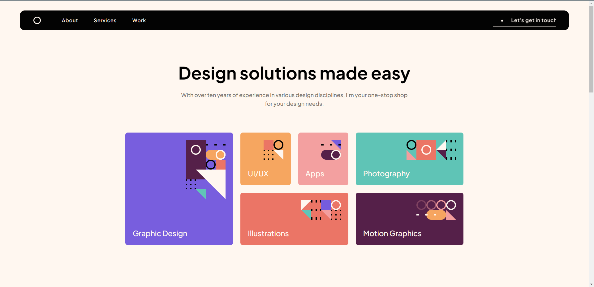
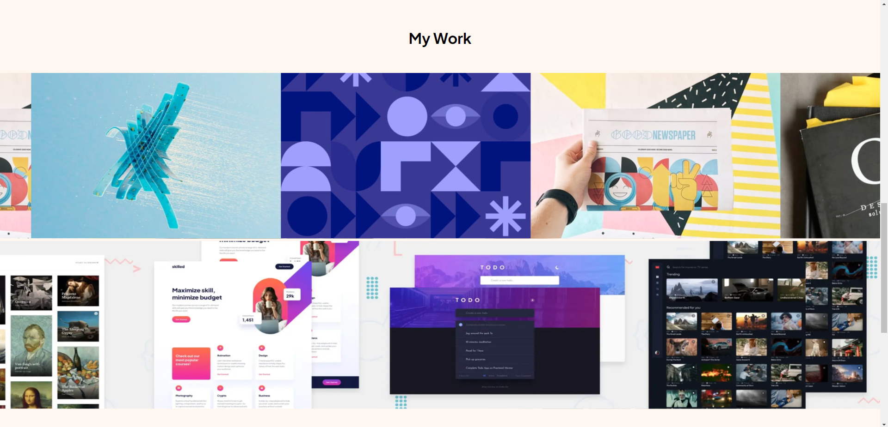

# Frontend Mentor - Single-page design portfolio solution

This is a solution to the [Single-page design portfolio challenge on Frontend Mentor](https://www.frontendmentor.io/challenges/singlepage-design-portfolio-2MMhyhfKVo). Frontend Mentor challenges help you improve your coding skills by building realistic projects.

## Table of contents

- [Overview](#overview)
  - [The challenge](#the-challenge)
  - [Screenshot](#screenshot)
  - [Links](#links)
- [My process](#my-process)
  - [Built with](#built-with)
  - [What I learned](#what-i-learned)
  - [Useful resources](#useful-resources)
- [Author](#author)

## Overview

### The challenge

Users should be able to:

- View the optimal layout for the site depending on their device's screen size
- See hover states for all interactive elements on the page
- Instead of navigate using a slider using either their mouse/trackpad or keyboard, I added a horizontal scrolling feature. Users will be able to see the thumbnails under 'My Work' scrolling infinitely.

### Screenshot

- Main: 
- My Work Section: 

### Links

- Solution URL: [Add solution URL here](https://your-solution-url.com)
- Live Site URL: [Add live site URL here](https://your-live-site-url.com)

## My process

### Built with

- Semantic HTML5 markup
- CSS custom properties
- Flexbox
- CSS Grid
- Desktop-first workflow
- [jQuery](https://jquery.com/) - JS library
- [GSAP TweenMax](https://greensock.com/docs/v2/TweenMax) - GSAP Animation library
- [Styled Components](https://styled-components.com/) - For styles

### What I learned

This challenge is heavier on the CSS side compared to JS. I learnt about horizontal scrolling animation and doing up a navbar without using Bootstrap which was something I had always been using.

### Useful resources

- [Horizontal scrolling text in css](https://blog.hubspot.com/website/scrolling-text-css) - This helped me for the code for horizontal scrolling. I have customized the code to my own logic.

---

The clonedList is needed to create an infinite horizontal scroll effect.

Here's how it works:

- First, the listWidth variable is calculated by adding up the width of each element in $list.
- Then, the endPos variable is calculated as the distance from the right edge of $btnLoop to the end of $list.
- Next, both $list and $clonedList are given a width of listWidth + "rem". This makes sure that both lists have the same width.
- The cloned list is then added to $btnLoop, positioned next to $list, and given a class of .cloned.
- Finally, a TimelineMax animation is created that animates both $list and $clonedList. The animation moves both lists to the left by listWidth pixels over a duration of time. Once this animation completes, another animation moves both lists back to their original position. This creates an infinite horizontal scrolling effect.
  By cloning the original list and positioning it next to it, we can create an illusion that there are two identical lists scrolling one after another.

Technically, you can manually repeat the elements in the HTML file to achieve the same effect. However, that would mean duplicating the same content in your HTML file which is not a good practice. By using JavaScript to clone and append the list, you avoid duplicating content in your HTML and make your code more efficient.

Also, if you want to change the content of the list dynamically at runtime, doing it through JavaScript would be much easier than having to update multiple copies of the same content in your HTML file.

---

The above explanation is taken from an AI tool known as debugcode.ai explaining the logic behind the need for a cloned list.

- [Responsive Navigation Bar](https://www.w3schools.com/howto/howto_js_topnav_responsive.asp) - A simple documentation by W3 Schools on responsive navbar.

## Author

- Frontend Mentor - [@joyoung](https://www.frontendmentor.io/profile/yourusername)
